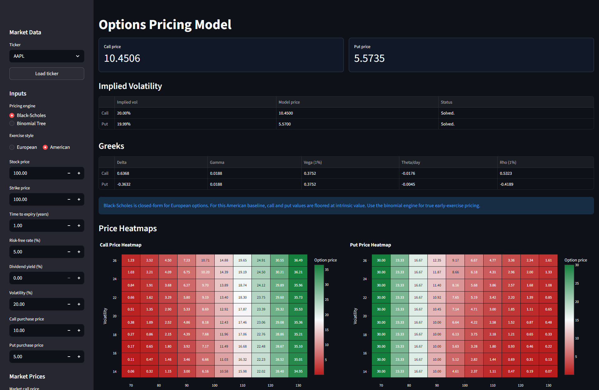
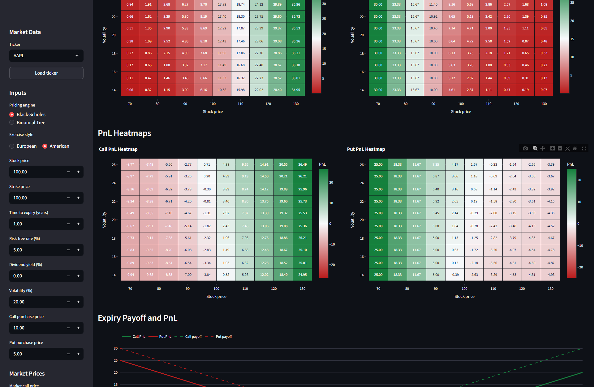
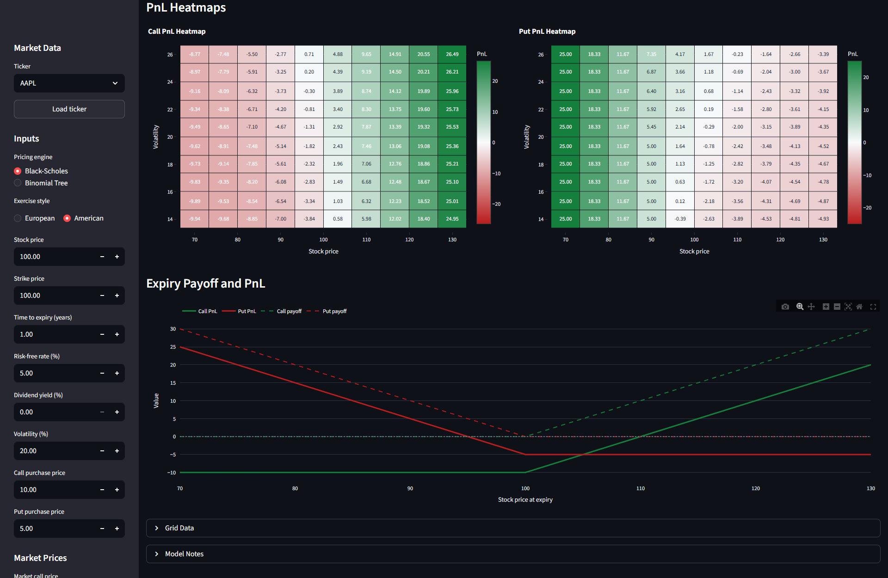

# Options Pricing Model

A Streamlit options analytics app built as a quant-trading portfolio project.
It combines pricing models, delayed option-chain data, implied volatility,
Greeks, scenario heatmaps, and expiry payoff charts in one workflow.

Live app: [earley-option-pricer.streamlit.app](https://earley-option-pricer.streamlit.app/)



## Screenshots

| Dashboard | Heatmaps | Payoff |
| --- | --- | --- |
|  |  |  |

## What Each Section Does

### Market Data

The sidebar can load delayed option-chain data through `yfinance`. Pick a ticker,
expiration, option type, and strike, then apply the selected contract to the
model inputs.

### Inputs

The pricing controls set spot, strike, time to expiry, risk-free rate, dividend
yield, volatility, pricing engine, and exercise style. Black-Scholes handles the
closed-form baseline; the binomial tree handles early-exercise logic.

### Market Prices

Market call and put prices are used to solve implied volatility, then compare
the model price against the listed market price.

### Shock Grid

The app builds price and PnL surfaces across spot and volatility shocks. This is
useful for seeing how option value and trade PnL change under a grid of market
scenarios.

### Results

The main dashboard shows call/put model prices, implied volatility, Greeks,
price heatmaps, PnL heatmaps, and expiry payoff/PnL curves.

## Guides

- [Getting started](docs/guides/getting-started.md)
- [App walkthrough](docs/guides/app-walkthrough.md)
- [Screenshot gallery](docs/guides/screenshot-gallery.md)
- [Project architecture](docs/guides/project-architecture.md)
- [Publishing checklist](docs/guides/publishing-checklist.md)

## Features

- Black-Scholes pricing for call and put options.
- Cox-Ross-Rubinstein binomial tree pricing for European and American options.
- Continuous dividend yield input.
- Greeks for call and put risk sensitivities.
- Implied volatility solving from market call and put prices.
- Delayed option-chain loading for selected or custom tickers via yfinance.
- Side-by-side call and put price heatmaps.
- Side-by-side call and put PnL heatmaps.
- Expiry payoff and PnL curves.
- CSV downloads for all price and PnL grids.
- Interactive Streamlit app plus a small Python CLI.

## Run Locally

Install dependencies:

```powershell
python -m pip install -e .
```

Launch the Streamlit app:

```powershell
python -m streamlit run app.py
```

Run the CLI:

```powershell
python -m options_pricing.cli
```

Price one option directly:

```powershell
python -m options_pricing.cli --stock-price 100 --strike-price 100 --time-to-expiry 1 --interest-rate 5% --dividend-yield 2% --volatility 20%
```

Rates, dividend yield, and volatility can be entered as decimals (`0.05`) or
percentages (`5%`). Time to expiry is measured in years.

## Deploy

The simplest portfolio setup is:

1. Push this repo to GitHub.
2. Create a Streamlit Community Cloud app from the repo.
3. Set the app entry point to `app.py`.

`requirements.txt` is included for Streamlit Cloud deployment.

## Test

```powershell
python -m unittest discover
```

## Model Notes

- Black-Scholes is a closed-form model for European options.
- The app keeps an American-style Black-Scholes baseline by flooring prices at
  intrinsic value, but true early exercise is handled by the binomial tree.
- The binomial tree uses the Cox-Ross-Rubinstein framework and checks early
  exercise at every node for American options.
- Greeks are analytic for Black-Scholes and finite-difference estimates for the
  binomial tree.

## Roadmap

- Add a cleaner visual theme for portfolio presentation.
- Add strategy builder support for spreads.
- Add paid-provider integration for higher quality real-time options data.
